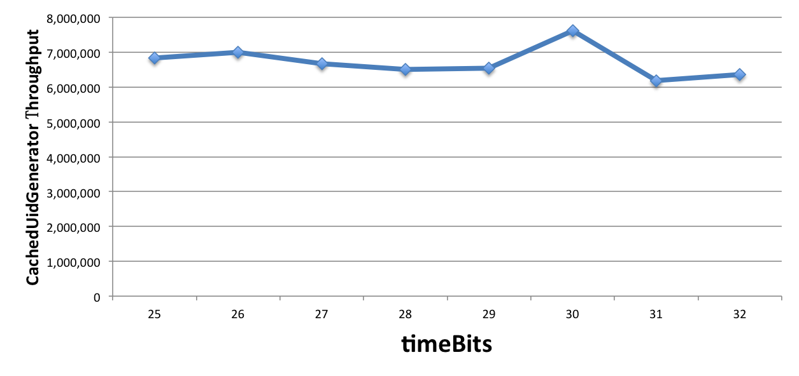

UidGenerator Performance Test Result
========

[In Chinese 中文版](UIDPerformance_zh.md)

### Tips

For low concurrency and long term application, less ```seqBits``` but more ```timeBits``` is
recommended. For
example, if DisposableWorkerIdAssigner is adopted and the average reboot frequency is 12 per node
per day, with the
configuration ```{"workerBits":23,"timeBits":31,"seqBits":9}```, one project can run for 68 years
with 28 nodes
and entirely concurrency 14400 UID/s.

For frequent reboot and long term application, less ```seqBits``` but more ```timeBits```
and ```workerBits``` is
recommended. For example, if DisposableWorkerIdAssigner is adopted and the average reboot frequency
is 24 * 12 per node
per day, with the configuration ```{"workerBits":27,"timeBits":30,"seqBits":6}```, one project can
run for 34 years
with 37 nodes and entirely concurrency 2400 UID/s.

#### Experiment for Throughput

To figure out CachedUidGenerator's UID throughput, some experiments are carried out.<br/>
Firstly, workerBits is arbitrarily fixed to 20, and change timeBits from 25(about 1 year) to 32(
about 136 years),<br/>

|  timeBits  |    25     |    26     |    27     |    28     |    29     |    30     |    31     |    32     |
|:----------:|:---------:|:---------:|:---------:|:---------:|:---------:|:---------:|:---------:|:---------:|
| throughput | 6,831,465 | 7,007,279 | 6,679,625 | 6,499,205 | 6,534,971 | 7,617,440 | 6,186,930 | 6,364,997 |



Then, timeBits is arbitrarily fixed to 31, and workerBits is changed from 20(about 1 million total
reboots) to 29(about
500 million total reboots),<br/>

| workerBits |    20     |    21     |    22     |    23     |    24     |    25     |    26     |    27     |    28     |    29     |
|:----------:|:---------:|:---------:|:---------:|:---------:|:---------:|:---------:|:---------:|:---------:|:---------:|:---------:|
| throughput | 6,186,930 | 6,642,727 | 6,581,661 | 6,462,726 | 6,774,609 | 6,414,906 | 6,806,266 | 6,223,617 | 6,438,055 | 6,435,549 |


It is obvious that whatever the configuration is, CachedUidGenerator always has the ability to
provide **6 million**
stable throughput, what sacrificed is just life expectancy, this is very cool.

Finally, both timeBits and workerBits are fixed to 31 and 23 separately, and change the number of
CachedUidGenerator
consumer. Since our CPU only has 4 cores, \[1, 8\] is chosen.<br/>

| consumers  |     1     |     2     |     3     |     4     |     5     |     6     |     7     |     8     |
|:----------:|:---------:|:---------:|:---------:|:---------:|:---------:|:---------:|:---------:|:---------:|
| throughput | 6,462,726 | 6,542,259 | 6,077,717 | 6,377,958 | 7,002,410 | 6,599,113 | 7,360,934 | 6,490,969 |


