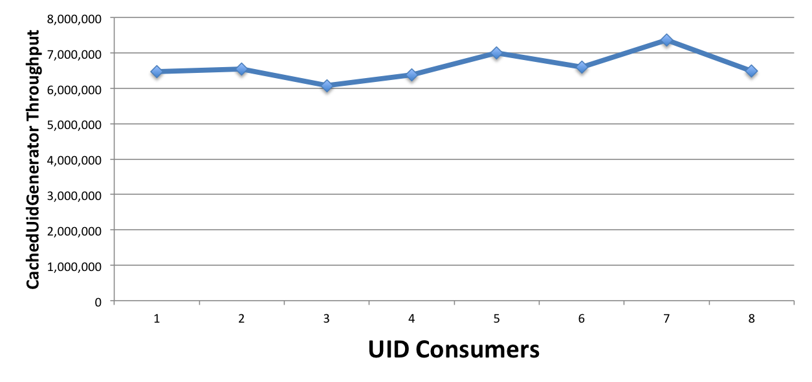

UidGenerator 性能测试结果
========

[In English](UIDPerformance.md)

#### 吞吐量测试

在MacBook Pro（2.7GHz Intel Core i5, 8G DDR3）上进行了CachedUidGenerator（单实例）的UID吞吐量测试.  
首先固定住workerBits为任选一个值(如20), 分别统计timeBits变化时(如从25至32, 总时长分别对应1年和136年)的吞吐量, 如下表所示: 

|timeBits|25|26|27|28|29|30|31|32|
|:---:|:---:|:---:|:---:|:---:|:---:|:---:|:---:|:---:|
|throughput|6,831,465|7,007,279|6,679,625|6,499,205|6,534,971|7,617,440|6,186,930|6,364,997|

再固定住timeBits为任选一个值(如31), 分别统计workerBits变化时(如从20至29, 总重启次数分别对应1百万和500百万)的吞吐量, 如下表所示: 

|workerBits|20|21|22|23|24|25|26|27|28|29|
|:---:|:---:|:---:|:---:|:---:|:---:|:---:|:---:|:---:|:---:|:---:|
|throughput|6,186,930|6,642,727|6,581,661|6,462,726|6,774,609|6,414,906|6,806,266|6,223,617|6,438,055|6,435,549|

由此可见, 不管如何配置, CachedUidGenerator总能提供**600万/s**的稳定吞吐量, 只是使用年限会有所减少. 这真的是太棒了.

最后, 固定住workerBits和timeBits位数(如23和31), 分别统计不同数目(如1至8,本机CPU核数为4)的UID使用者情况下的吞吐量, 

|workerBits|1|2|3|4|5|6|7|8|
|:---:|:---:|:---:|:---:|:---:|:---:|:---:|:---:|:---:|
|throughput|6,462,726|6,542,259|6,077,717|6,377,958|7,002,410|6,599,113|7,360,934|6,490,969|

